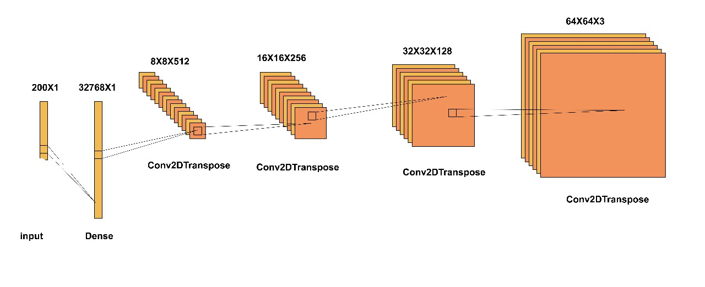
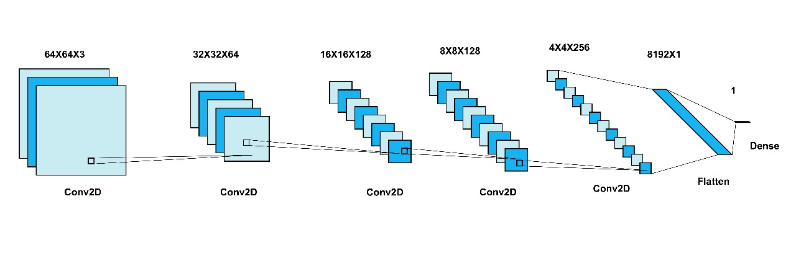

# Fashion Generator

This project is a fashion generator that utilizes Generative Adversarial Networks (GANs) to generate fashion images. The implementation uses Convolutional Neural Networks (CNNs) with the PyTorch library. The GAN model consists of two main components: the Generator and the Discriminator. 

## Table of Contents

- [Introduction](#introduction)
- [Features](#features)
- [Technologies Used](#technologies-used)
- [Model Architecture](#model-architecture)
  - [Generator](#generator)
  - [Discriminator](#discriminator)
- [Usage](#Usage)
- [Contributing](#contributing)
- [License](#license)

## Introduction

The Fashion Generator project uses GANs to create high-quality fashion images. GANs are composed of two neural networks, the Generator and the Discriminator, which work in opposition to improve the quality of generated images. This project aims to generate realistic fashion images based on input data.

## Features

- Generates high-quality fashion images
- Utilizes GAN architecture with CNNs
- Implemented using the PyTorch library

## Technologies Used

- PyTorch
- Python
- Convolutional Neural Networks (CNNs)
- GAN (Generative Adversarial Network)

## Model Architecture

### Generator

The Generator is responsible for creating fashion images from random noise. It uses CNN layers to produce realistic images. Below is an illustration of the Generator architecture:



### Discriminator

The Discriminator's role is to distinguish between real and generated images. It also uses CNN layers to classify images as real or fake. Below is an illustration of the Discriminator architecture:




## Usage
1. Clone the repository
```bash
  git clone https://github.com/abhinavbura/fashiongenerator.git
```
2. Run the ui.py file
```bash
  python ui.py
```

## Contributing

Contributions are welcome! Please open an issue or submit a pull request if you have any improvements or bug fixes.

## License

This project is licensed under the MIT License. See the [LICENSE](LICENSE) file for details.
